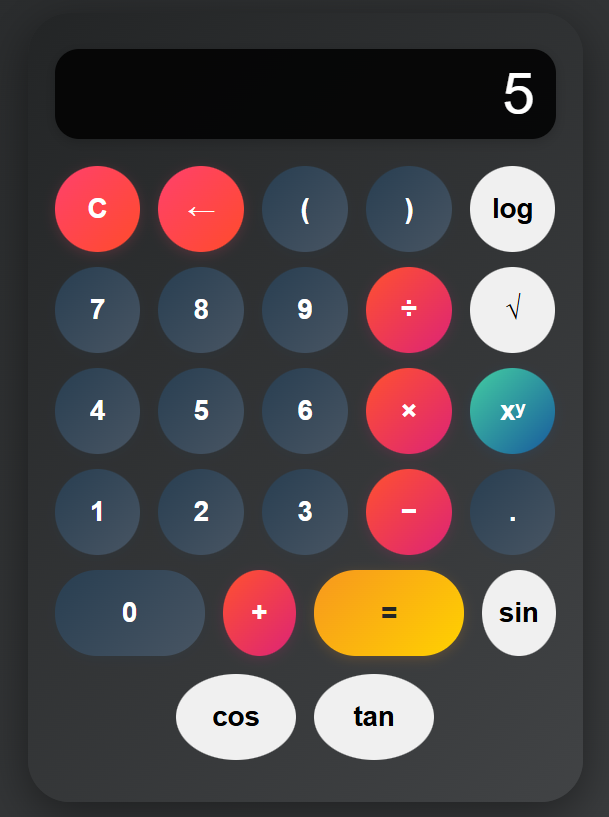

# Scientific Calculator

A simple and easy-to-use scientific calculator web application built with HTML, CSS, and JavaScript.

## Features

*   Basic arithmetic operations (addition, subtraction, multiplication, division).
*   Scientific functions such as square root, logarithm, power, and trigonometric functions (sin, cos, tan).
*   Factorial calculations.
*   A responsive design that works on various screen sizes.

## Screenshot




## Getting Started

To get a local copy up and running, follow these simple steps.

### Prerequisites

There are no special prerequisites. You only need a modern web browser.

### Installation

1.  Clone the repo:
    ```sh
    git clone https://github.com/IviweBooi/Calculator-Web-App.git
    ```
2.  Navigate to the project directory:
    ```sh
    cd Calculator-Web-App
    ```
## Usage

Open the `index.html` file in your favorite web browser to start using the calculator.

## Running the Tests

This project uses Jasmine for unit testing. To run the tests, open the `tests/SpecRunner.html` file in your web browser. The test results will be displayed on the page.

## License

This project is licensed under the MIT License. See the `LICENSE` file for more details.
